### PICKLING IN PYTHON

Python pickle module is used for serializing and de-serializing a Python object structure. Any object in Python can be pickled so that it can be saved on disk. What pickle does is that it “serializes” the object first before writing it to file. Pickling is a way to convert a python object (list, dict, etc.) into a character stream. The idea is that this character stream contains all the information necessary to reconstruct the object in another python script.

Storing data into pickle file
```python
import pickle
x = [1, 2, 3]
file = open('filename', 'wb or ab')
pickle.dump(x, file)
file.close()
```
Loading data from a pickled file
```python
import pickle
file = open('filename', 'rb')
x = pickle.load(file)
file.close()
```
### NEURAL NETWORKS

Neural networks are multi-layer networks of neurons (the blue and magenta nodes in the chart below) that we use to classify things, make predictions, etc.Below is the diagram of a simple neural network with five inputs, 5 outputs, and two hidden layers of neurons.

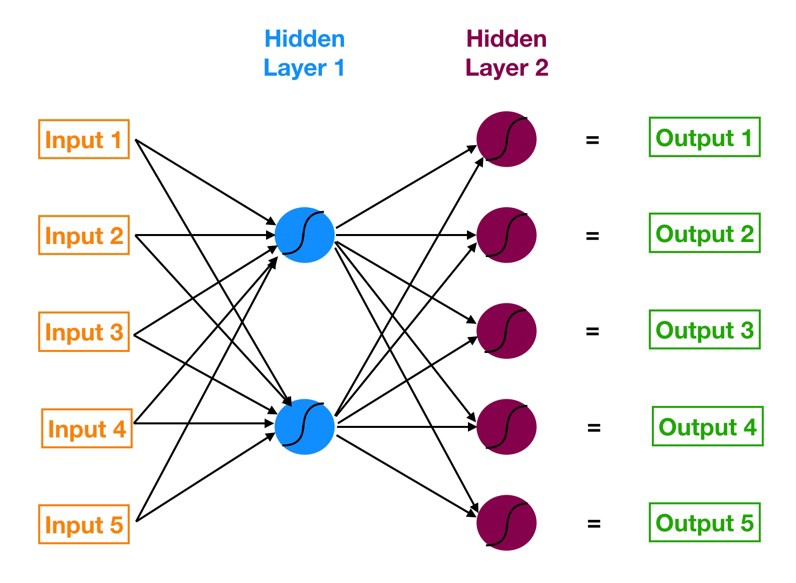

Starting from the left, we have:
1. The input layer of our model in orange.
2. Our first hidden layer of neurons in blue.
3. Our second hidden layer of neurons in magenta.
4. The output layer (a.k.a. the prediction) of our model in green.

The arrows that connect the dots shows how all the neurons are interconnected and how data travels from the input layer all the way through to the output layer.

#### THE VERY BASICS OF NEURAL NETWORK - a neural network with one neuron

What exactly is a neural network trying to do? Like any other model, it’s trying to make a good prediction. We have a set of inputs and a set of target values — and we are trying to get predictions that match those target values as closely as possible.  
Forget for a second the more complicated looking picture of the neural network I drew above and focus on this simpler one below.  
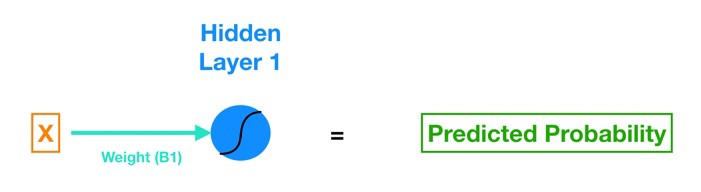

In the above image, we have 3 layers, the input layer, the hidden layer and the output layer. The intermediate hidden layer has only one neuron in it. Every neuron in a neural network is comprised of an activation function, which is a mathematical function that is used to generate the output of the neuron, using the input. Every edge connected to a neuron is associated with a weight, whose values are decided by the neural network through training.  

`Predicted probability = F(X)`  


Here F in the activation function through which the input X is processed to get the predicted output.  

 

Let’s examine each element:
1. X (in orange) is our input, the lone feature that we give to our model in order to calculate a prediction.
2. B<sub>1</sub> (in turquoise, a.k.a. blue-green) is the estimated slope parameter of our logistic regression — B<sub>1</sub> tells us by how much the Log_Odds change as X changes (B<sub>1</sub> is the weight of the edge). Notice that B<sub>1</sub> lives on the turquoise line, which connects the input X to the blue neuron in Hidden Layer 1.
3. B<sub>0</sub> (in blue) is the bias — very similar to the intercept term from regression. The key difference is that in neural networks, every neuron has its own bias term (while in regression, the model has a singular intercept term).
4. The blue neuron also includes a sigmoid activation function (denoted by the curved line inside the blue circle).
5. And finally we get our predicted probability by applying the sigmoid function to the quantity (B<sub>1</sub>*X + B<sub>0</sub>).

Output = $\sigma(B1 * x + B0) = \frac{1}{1 + e^{-(B1*x + B0)}}$

#### A More Complex Neural Network

Now that we have our basic framework, let’s go back to our slightly more complicated neural network and see how it goes from input to output. Here it is again for reference:


The first hidden layer consists of two neurons. So to connect all five inputs to the neurons in Hidden Layer 1, we need ten connections. The next image (below) shows just the connections between Input 1 and Hidden Layer 1.   

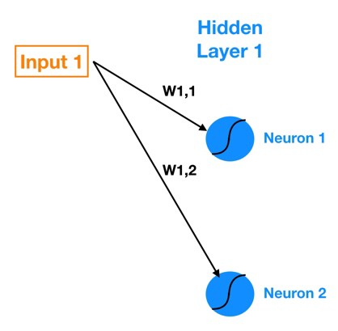
Note our notation for the weights that live in the connections — W<sub>1,1</sub> denotes the weight that lives in the connection between Input 1 and Neuron 1 and W<sub>1,2</sub> denotes the weight in the connection between Input 1 and Neuron 2. So the general notation that I will follow is W<sub>a,b</sub> denotes the weight on the connection between Input a (or Neuron a) and Neuron b. 
<br> <br> 
Now let’s calculate the outputs of each neuron in Hidden Layer 1 (known as the activations). We do so using the following formulas (W denotes weight, In denotes input). 
$$Z_1 = Inp_1W_1 + Inp_2W_2 + Inp_3W_3 + Inp_4W_4 + Inp_5W_5 + B_1 $$
$$Neuron_1  activation = Sigmoid(Z_1)$$
<br> <br> 
We can use matrix math to summarize this calculation (remember our notation rules — for example, W4,2 denotes the weight that lives in the connection between Input 4 and Neuron 2):  
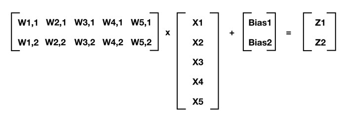 
For any layer of a neural network where the prior layer is m elements deep and the current layer is n elements deep, this generalizes to:  

$[W] @ [X] + [Bias] = [Z]$ 

Where [W] is your n by m matrix of weights (the connections between the prior layer and the current layer), [X] is your m by 1 matrix of either starting inputs or activations from the prior layer, [Bias] is your n by 1 matrix of neuron biases, and [Z] is your n by 1 matrix of intermediate outputs. In the previous equation, I follow Python notation and use @ to denote matrix multiplication. Once we have [Z], we can apply the activation function (sigmoid in our case) to each element of [Z] and that gives us our neuron outputs (activations) for the current layer.  

### HOW DOES THE NEURAL NETWORK LEARN

_The training process of a neural network, at a high level, is like that of many other data science models — **define a cost function and use gradient descent optimization to minimize it**._  

#### The cost function  
We want to find the set of weights (remember that each connecting line between any two elements in a neural network houses a weight) and biases (each neuron houses a bias) that minimize our cost function — where the cost function is an approximation of how wrong our predictions are relative to the target outcome. 

There are different cost functions that are in use by neural network enginee
For training our neural network, we will use Mean Squared Error (MSE) as the cost function as an example and see how it works:  

$$MSE = \frac{Sum [ ( Prediction - Actual )^2 ]}{num-of-observations}$$

The MSE of a model tell us on average how wrong we are but with a twist — by squaring the errors of our predictions before averaging them, we punish predictions that are way off much more severely than ones that are just slightly off. The cost functions of linear regression and logistic regression operate in a very similar manner.  

We use a method known as gradient descent to minimise our cost function. to use gradient descent, we need to know the gradient of our cost function, the vector that points in the direction of greatest steepness (we want to repeatedly take steps in the opposite direction of the gradient to eventually arrive at the minimum).  
Except in a neural network we have so many changeable weights and biases that are all interconnected. How do we calculate the gradient of all of that? Let's see how gradient descent helps with that.

##### Quick review of Gradient Descent
The gradient of a function is the vector whose elements are its partial derivatives with respect to each parameter. For example, if we were trying to minimize a cost function, C(B<sub>0</sub>, B<sub>1</sub>), with just two changeable parameters, B0 and B1, the gradient would be:  

$$GradientOfC(B_0, B_1) = [ \frac{dC}{dB_0}, \frac{dC}{dB_1} ]$$

So each element of the gradient tells us how the cost function would change if we applied a small change to that particular parameter — so we know what to tweak and by how much. To summarize, we can march towards the minimum by following these steps:  
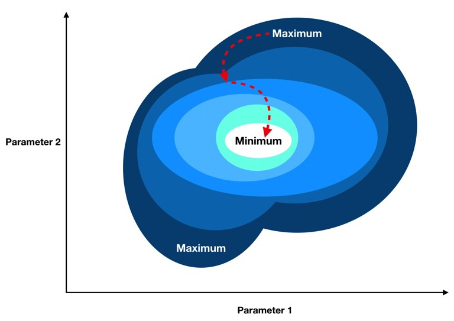 
1. Compute the gradient of our “current location” (calculate the gradient using our current parameter values).
2. Modify each parameter by an amount proportional to its gradient element and in the opposite direction of its gradient element. For example, if the partial derivative of our cost function with respect to B0 is positive but tiny and the partial derivative with respect to B1 is negative and large, then we want to decrease B0 by a tiny amount and increase B1 by a large amount to lower our cost function.
3. Recompute the gradient using our new tweaked parameter values and repeat the previous steps until we arrive at the minimum.
<br> <br>

##### Backpropagation

Remember that forward propagation is the process of moving forward through the neural network (from inputs to the ultimate output or prediction). Backpropagation is the reverse. Except instead of signal, we are moving error backwards through our model.  
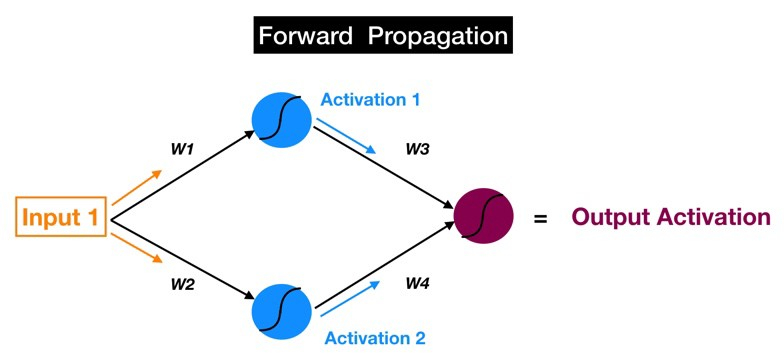  


Some simple visualizations helped a lot when I was trying to understand the backpropagation process. Below is my mental picture of a simple neural network as it forward propagates from input to output. The process can be summarized by the following steps:
- Inputs are fed into the blue layer of neurons and modified by the weights, bias, and sigmoid in each neuron to get the activations. For example: $Activation_1 = Sigmoid( Bias_1 + W_1*Input_1 )$
- Activation 1 and Activation 2, which come out of the blue layer are fed into the magenta neuron, which uses them to produce the final output activation.

And the objective of forward propagation is to calculate the activations at each neuron for each successive hidden layer until we arrive at the output.  

Now let’s just reverse it. If you follow the red arrows (in the picture below), you will notice that we are now starting at the output of the magenta neuron. That is our output activation, which we use to make our prediction, and the ultimate source of error in our model. We then move this error backwards through our model via the same weights and connections that we use for forward propagating our signal (so instead of Activation 1, now we have Error1 — the error attributable to the top blue neuron).Now let’s just reverse it. If you follow the red arrows (in the picture below), you will notice that we are now starting at the output of the magenta neuron. That is our output activation, which we use to make our prediction, and the ultimate source of error in our model. We then move this error backwards through our model via the same weights and connections that we use for forward propagating our signal (so instead of Activation 1, now we have Error1 — the error attributable to the top blue neuron).  

Remember we said that the goal of forward propagation is to calculate neuron activations layer by layer until we get to the output? We can now state the objective of backpropagation in a similar manner:  

_**We want to calculate the error attributable to each neuron (I will just refer to this error quantity as the neuron’s error because saying “attributable” again and again is no fun) starting from the layer closest to the output all the way back to the starting layer of our model.**_  
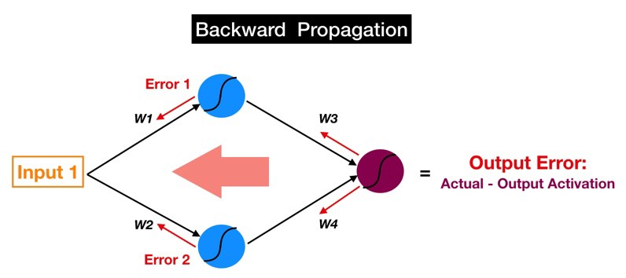 

So the error of each neuron is a proxy for the partial derivative of the cost function with respect to that neuron’s inputs. This makes intuitive sense — if a particular neuron has a much larger error than all the other ones, then tweaking the weights and bias of our offending neuron will have a greater impact on our model’s total error than fiddling with any of the other neurons.  

And the partial derivatives with respect to each weight and bias are the individual elements that compose the gradient vector of our cost function. **So basically backpropagation allows us to calculate the error attributable to each neuron and that in turn allows us to calculate the partial derivatives and ultimately the gradient so that we can utilize gradient descent**.

#### ACTIVATION FUNCTION

Activation function decides, whether a neuron should be activated or not by calculating weighted sum and further adding bias with it. The purpose of the activation function is to introduce non-linearity into the output of a neuron.   

Input = &Sigma;x<sub>i</sub>w<sub>i</sub> + b  
We will see in detail later what x<sub>i</sub>, w<sub>i</sub> and b represent. 

Let's see some of the activation functions that are commonly used.  
##### *Linear function - $f(x) = x$*
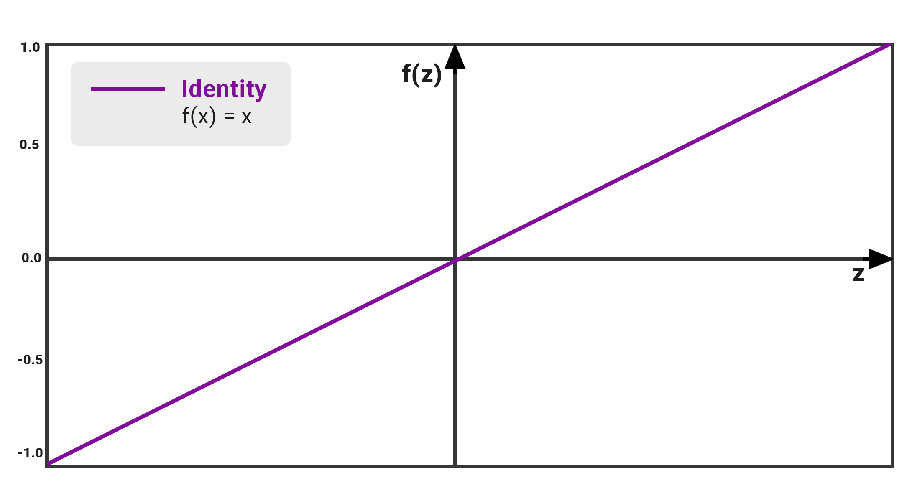   

The value of f(z) increases proportionally with the value of z.
The output of the function is not confined between any range; that is, the value of f(z) can go from which not necessarily a problem as we can proceed into the next or final layer by taking the max value of the neurons that have fired after com.  
Apart from that, the linear activation function has its set of disadvantages such as:
- We observe that the function’s derivative is a constant. That means there is constant gradient descent occurring since there is no relation to the value of z.
- Our model is not really learning as it does not improve upon the error term, which is the whole point of the neural network.
- Since the activation is linear, nesting in 2 or N number of hidden layers with the same function will have no real effect. The N layers could basically be squashed into one layer.
- We see that this function is not fit to handle complex. So in order to fix this issue, we use non-linear functions to enable our model to learn iteratively.

##### *Sigmoid function -   $\sigma(x) = \frac{1}{1+e^{-x}}$*
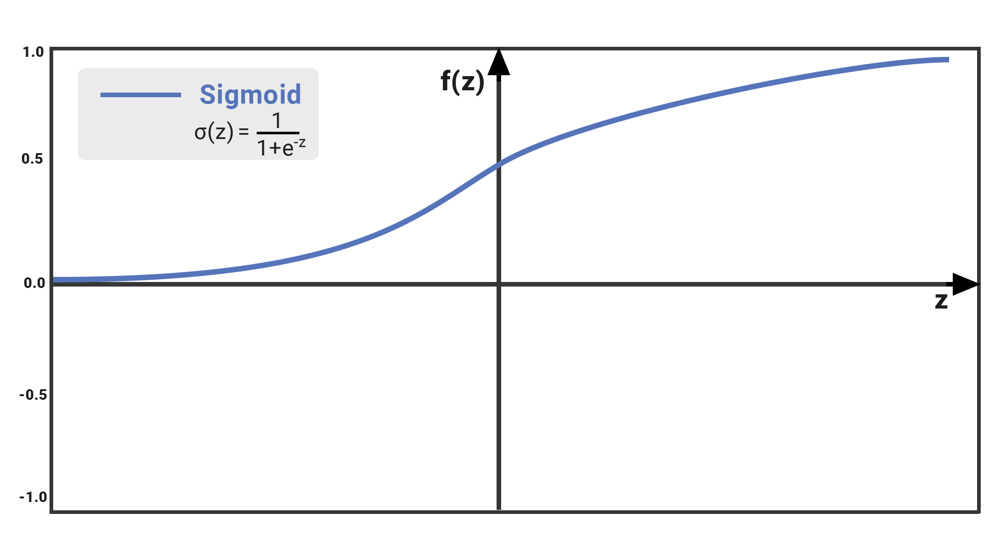  

The Sigmoid function takes a value as input and outputs another value between 0 and 1. It is non-linear and easy to work with when constructing a neural network model. The good part about this function is that continuously differentiable over different values of x and has a fixed output range.  

On observation, we see that the value of f(x) increases but at a very slow rate. The mathematical reason is that as x (on the x-axis) increases, the value of e exponent -x becomes infinitesimally small and the value of f(x) become equals to 1 at some point. In other words, the function is susceptible to the vanishing gradient problem that we discussed in the previous lecture. The high-level problem is that models that utilize the sigmoid activation our slow learners and in the experimentation phase will generate prediction values which have lower accuracy.  

Another issue with this function arises when we have multiple hidden layers in our neural network. All the values we are getting through this activation function are positive and sigmoid churns out values of different magnitudes between 0–1 range so it becomes hard to optimize.  

Disadvantages aside, we do see sigmoid function used especially in binary classification models as part of the output layer to capture the probability ranging from 0 to 1.    

##### *Tanh function -  $tanh(x) = \frac{2}{1+e^{-2x}}$*
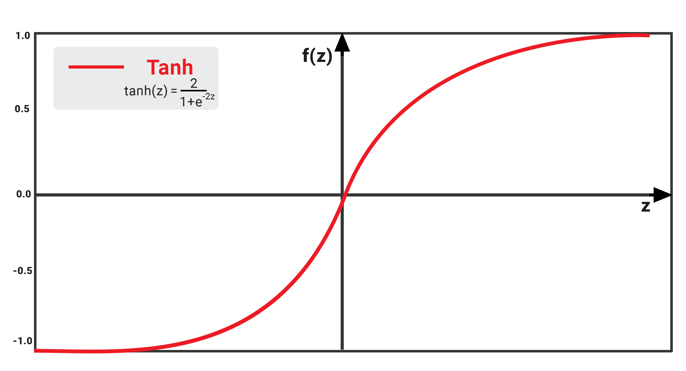  

The Tanh function is a modified or scaled up version of the sigmoid function. What we saw in Sigmoid was that the value of f(x) is bounded between 0 and 1; however, in the case of Tanh the values are bounded between -1 and 1.  

This is neat in the sense, we are able to get values of different signs, which helps us in establishing which scores to consider in the next layer and which to ignore. But, this function still has the vanishing gradient problem that was seen in the sigmoid function. The model slows down exponentially beyond the +2 and -2 range. The change in gradient is very small except within this narrow range.  

Last bit about Tanh and Sigmoid, the gradient or the derivative of the Tanh function is steeper as compared to the sigmoid function which we can observe in figure below. Our choice of using Sigmoid or Tanh really depends on the requirement of the gradient for the problem statement.  

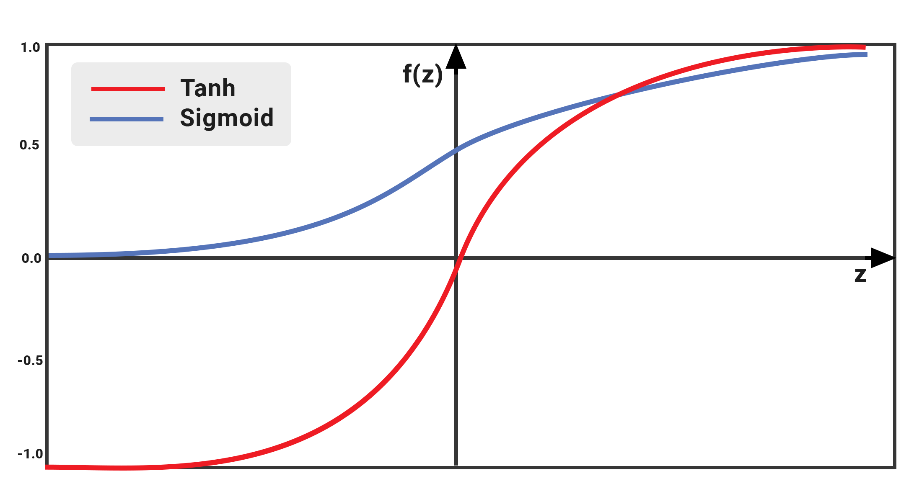  

##### *ReLU function -  $relu(x) = max(0, x)$*
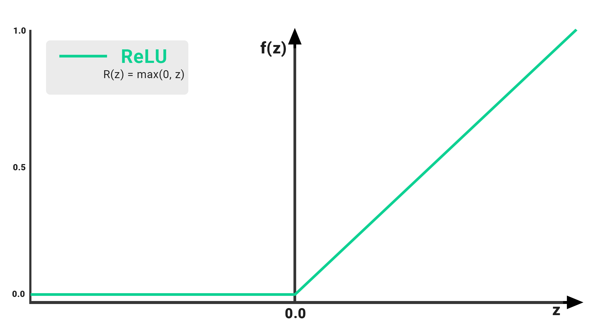  

The Rectified Linear Unit or ReLU for short would be considered the most commonly used activation function in deep learning models. The function simply outputs the value of 0 if it receives any negative input, but for any positive value x, it returns that value back like a linear function. So it can be written as f(x)=max(0,x).  

However, it should be noted that the ReLU function is still non-linear so we are able to backpropagate the errors and have multiple layers of neurons. This function was quickly adopted, as ReLU took care of several problems faced by the Sigmoid and the Tanh:  
- The ReLU function has a derivative of 0 over half of its range which spans across all the negative numbers. For positive inputs, the derivative is 1. So we have rectified the ‘vanishing’ gradient problem.
- At a time only a few neurons are activated making the network sparse making it efficient (We will see that sparsity is not always a good thing).
- It is computationally economical compared to Sigmoid and Tanh.


ReLU has its own set of limitations and disadvantages despite being a better activation function than its other non-linear alternatives:
- The function suffers from the dying ReLU problem — For activations correspondent to values of z< 0, the gradient will be 0 because of which the weights will not get adjusted during the gradient descent in backpropagation. That means, such neurons will stop responding to variations in error/input, so the output network becomes passive due to added sparsity.
- It is best used in between the input and output layers, more specifically within hidden  

As a final note on ReLU, there is a way to counter the dying ReLU problem by using a modified version of the function called the ‘Leaky’ ReLU. To put it briefly, we take the x < 0 values that form the y = 0 line and convert it into a non-horizontal straight line by adding a small, non-zero, constant gradient α (Normally, α=0.01). So our new formula for x < 0 is f(x) = αx.  

For more information, I have attached the Research paper for Leaky ReLU: https://arxiv.org/abs/1502.01852

#### COST FUNCTIONS/ OPTIMIZERS

The goal of machine learning and deep learning is to reduce the difference between the predicted output and the actual output. This is also called as a Cost function(C) or Loss function. Cost functions are convex functions.  

As our goal is to minimize the cost function by finding the optimized value for weights. We also need to ensure that the algorithm generalizes well. This will help make a better prediction for the data that was not seen before.  

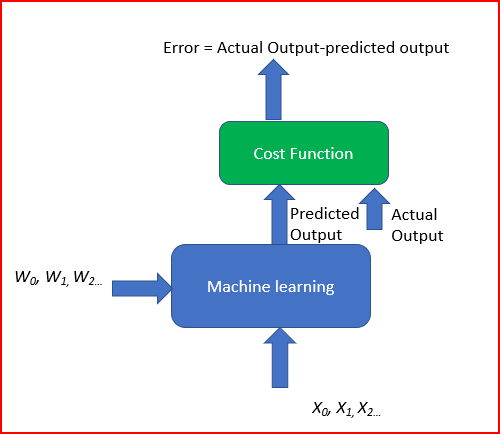

To achieve this we run multiple iterations with different weights. This helps to find the minimum cost. This is Gradient descent.  

##### Gradient Descent
Gradient descent is an iterative machine learning optimization algorithm to reduce the cost function. This will help models to make accurate predictions.  


Gradient indicates the direction of increase. As we want to find the minimum point in the valley we need to go in the opposite direction of the gradient. We update parameters in the negative gradient direction to minimize the loss.

$$ \theta = \theta - \eta\nabla J(\theta; x,y)$$

#### Role of Optimiser

Optimizers update the weight parameters to minimize the loss function. Loss function acts as guides to the terrain telling optimizer if it is moving in the right direction to reach the bottom of the valley, the global minimum.  

##### Types of Optimisers

**Momentum**
Momentum is like a ball rolling downhill. The ball will gain momentum as it rolls down the hill.  
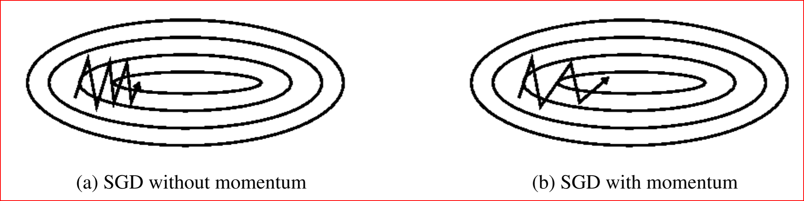

Momentum helps accelerate Gradient Descent(GD) when we have surfaces that curve more steeply in one direction than in another direction. It also dampens the oscillation as shown above  

For updating the weights it takes the gradient of the current step as well as the gradient of the previous time steps. This helps us move faster towards convergence.  
Convergence happens faster when we apply momentum optimizer to surfaces with curves.  

$\nu _t = \gamma \nu _{t-1} + \eta \nabla J(\theta; x, y) $  
$ \theta = \theta - \nu _t $  

**Nesterov accelerated gradient(NAG)**
Nesterov acceleration optimization is like a ball rolling down the hill but knows exactly when to slow down before the gradient of the hill increases again.  

We calculate the gradient not with respect to the current step but with respect to the future step. We evaluate the gradient of the looked ahead and based on the importance then update the weights.  


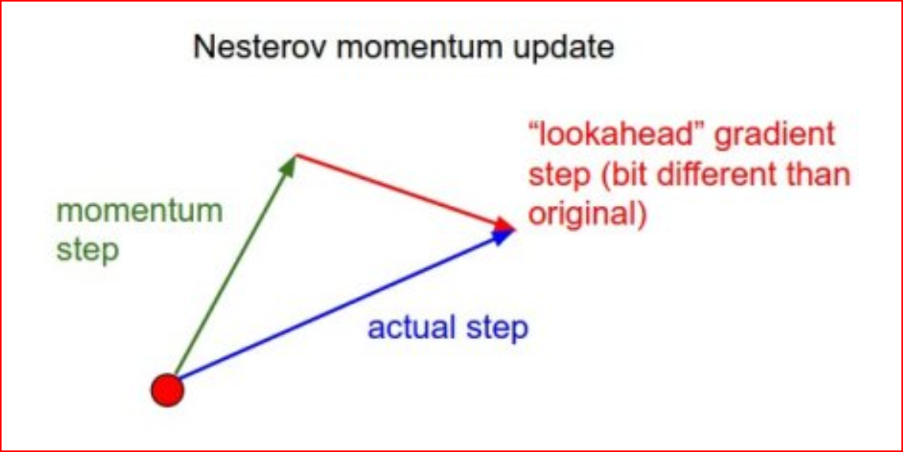  

NAG is like you are going down the hill where we can look ahead in the future. This way we can optimize our descent faster. Works slightly better than standard Momentum.  

$ \theta = \theta - \nu _t $  
$\nu _t = \gamma \nu _{t-1} + \eta \nabla J(\theta - \gamma \nu _{t-1}) $   
$ \theta - \gamma \nu _{t-1}$ is the gradient of looked ahead  

**Adagrad — Adaptive Gradient Algorithm**

We need to tune the learning rate in Momentum and NAG which is an expensive process.  

Adagrad is an adaptive learning rate method. In Adagrad we adopt the learning rate to the parameters. We perform larger updates for infrequent parameters and smaller updates for frequent parameters.  

It is well suited when we have sparse data as in large scale neural networks. GloVe word embedding uses adagrad where infrequent words required a greater update and frequent words require smaller updates.  

For SGD, Momentum, and NAG we update for all parameters $\theta$ at once. We also use the same learning rate $\eta$. In Adagrad we use different learning rate for every parameter $\theta$ for every time step $t$  

$\theta _{t+1} = \theta _t - \frac{\eta}{\sqrt{G_t + \epsilon}}.g_t$   
G<sub>t</sub>  is sum of squares of the past gradients w.r.t. to all parameters $\theta$    

**Adagrad eliminates the need to manually tune the learning rate.**  

In the denominator, we accumulate the sum of the square of the past gradients. Each term is a positive term so it keeps on growing to make the learning rate η infinitesimally small to the point that algorithm is no longer able learning. **Adadelta, RMSProp, and adam tries to resolve Adagrad’s radically diminishing learning rates.**  

**Adadelta**

- Adadelta is an extension of Adagrad and it also tries to reduce Adagrad’s aggressive, monotonically reducing the learning rate
- It does this by restricting the window of the past accumulated gradient to some fixed size of w. Running average at time t then depends on the previous average and the current gradient
- In Adadelta we do not need to set the default learning rate as we take the ratio of the running average of the previous time steps to the current gradient

$\theta _{t+1} = \theta _t + \Delta \theta _t $  
<br>
$ \Delta \theta = - \frac{RMS[\Delta\theta]+{t-1}}{RNS[g_t]} . g_t  $

**RMSProp**

- RMSProp is Root Mean Square Propagation. It was devised by Geoffrey Hinton.
- RMSProp tries to resolve Adagrad’s radically diminishing learning rates by using a moving average of the squared gradient. It utilizes the magnitude of the recent gradient descents to normalize the gradient.
- In RMSProp learning rate gets adjusted automatically and it chooses a different learning rate for each parameter.
- RMSProp divides the learning rate by the average of the exponential decay of squared gradients.


